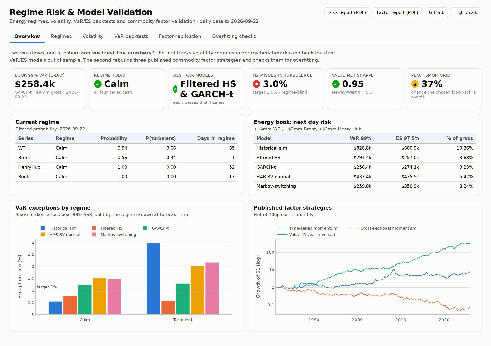
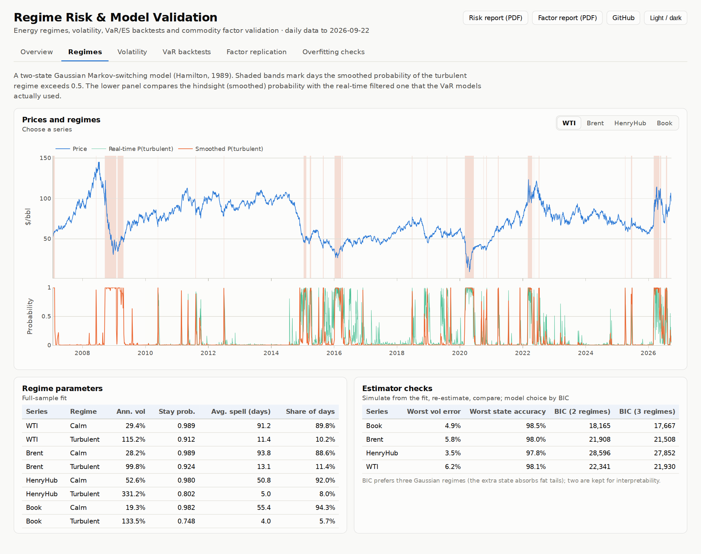
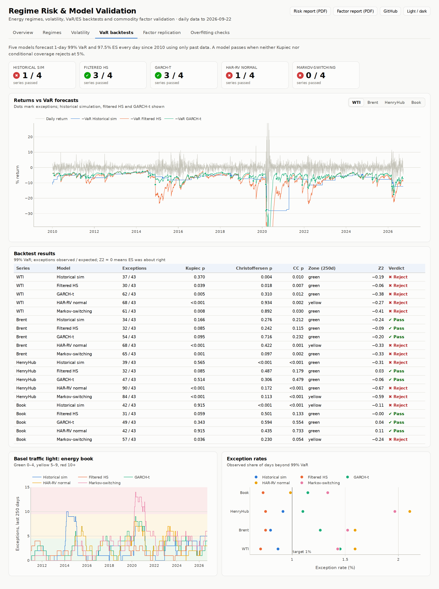
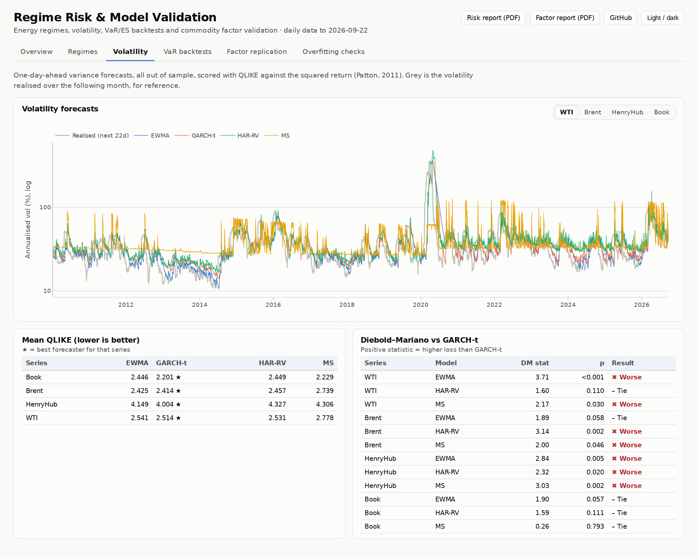
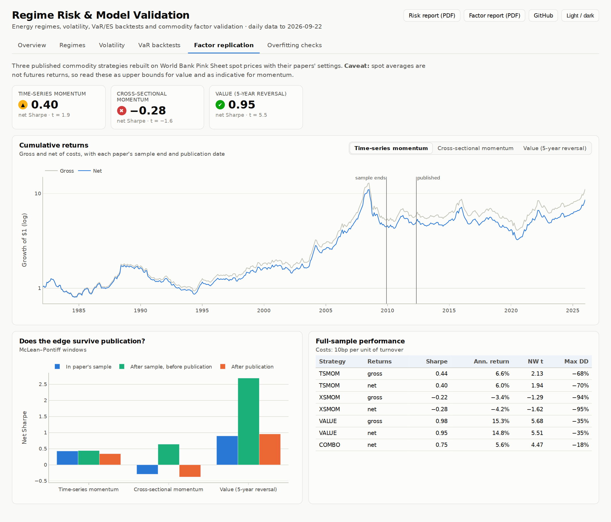
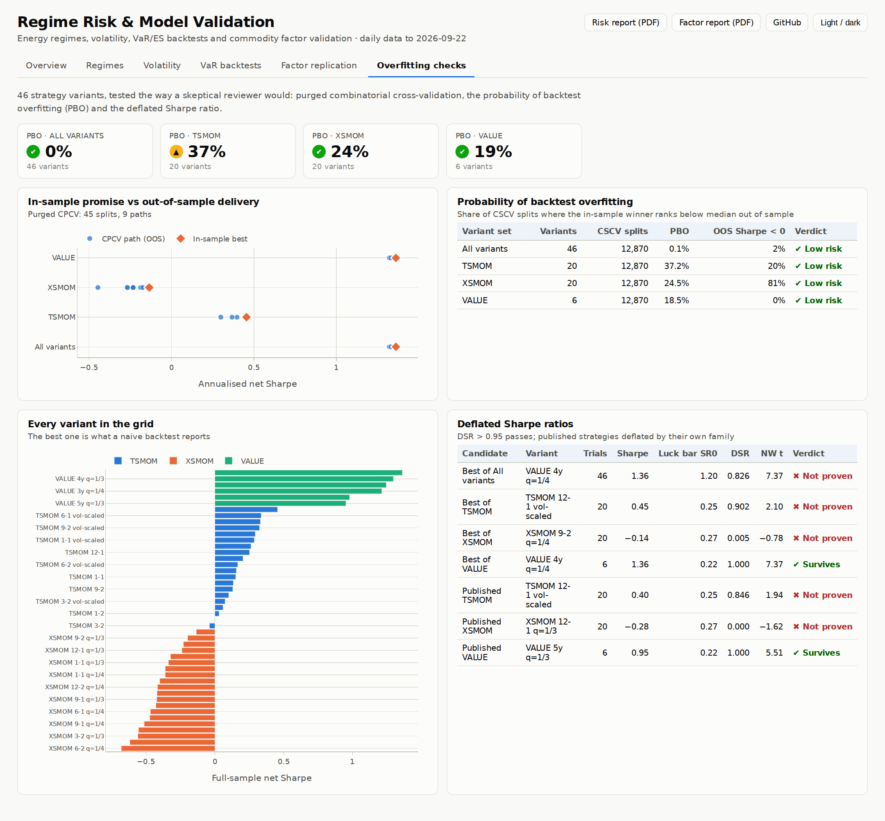

# Regime Risk & Model Validation: Commodity Regimes, VaR Backtests and Factor Overfitting Checks in Python

**📄 [Regime & risk report (PDF)](reports/regime_risk_summary.pdf)** · **📄 [Factor validation report (PDF)](reports/factor_validation_summary.pdf)** · **📊 [Open the live dashboard](https://n9omi.github.io/regime-risk-and-model-validation/)**

Two end-to-end case studies in the daily work of a market risk or model validation team. Each one pulls free public data, cleans it, fits the models, tests them against history the way a validator would, and writes a PDF report and an interactive dashboard. Every estimator (Markov switching, GARCH, VaR tests, cross-validation, deflated Sharpe) is written from scratch in readable Python, so every number traces back to code you can read in one sitting.

**1. Regimes and risk: "Which regime is the energy market in, and can we trust our VaR?"**
Takes daily EIA spot prices for WTI, Brent and Henry Hub, plus an $8mm energy book (long WTI, short Brent, long gas), and:
- detects **calm and turbulent regimes** with a Markov-switching model (Hamilton filter, Kim smoother, EM), and checks the estimator by simulation
- forecasts tomorrow's volatility four ways (**EWMA, GARCH-t, HAR-RV, Markov-switching**) and ranks them with QLIKE loss and **Diebold–Mariano** tests
- forecasts **1-day 99% VaR and 97.5% ES** five ways, every day since 2010, strictly out of sample
- **backtests** them with **Kupiec**, **Christoffersen**, conditional coverage, the **Basel traffic light**, **Acerbi–Szekely Z2** and **McNeil–Frey**, and splits exceptions by regime

**2. Factor validation: "Do published commodity strategies survive honest out-of-sample testing?"**
Rebuilds three published strategies (time-series momentum, cross-sectional momentum and value) on 46 years of World Bank commodity prices, and:
- compares performance **in each paper's sample, after it, and after publication** (McLean–Pontiff decay)
- tries **46 parameter variants** and asks what choosing the best one would really have earned, using **combinatorial purged cross-validation** with purging and embargo
- measures the **probability of backtest overfitting (PBO)** and the **deflated Sharpe ratio**, which charges a strategy for every variant tried

**What you get:** two PDF reports, a static dashboard you can open in any browser or host free on GitHub Pages, and every table as CSV. Report text is generated from the numbers, so it stays accurate when the data updates.

**Who it's for:**
- **Risk, model-risk and quant hiring managers:** a working example of the checks SR 11-7 asks for (conceptual soundness, benchmarking, outcomes analysis, ongoing monitoring) applied to regime, volatility, VaR and factor models.
- **Students and career-switchers:** a commented reference implementation of standard methods (Hamilton, Bollerslev, Corsi, Kupiec, Christoffersen, López de Prado) that runs with one command and changes through one config file.
- **Researchers:** a template for reporting a backtest honestly: purged CV, PBO, deflated Sharpe and publication decay in one place.

---

## Table of contents

- [Reports and highlights](#reports-and-highlights)
- [Dashboard](#dashboard)
- [Workflows](#workflows)
- [How to use and run](#how-to-use-and-run)
- [Data sources](#data-sources)
- [How each workflow is organised](#how-each-workflow-is-organised)
- [Notation](#notation)
- [Repository layout](#repository-layout)
- [Design choices](#design-choices)
- [Key references](#key-references)
- [Disclaimer](#disclaimer)

---

## Reports and highlights

📄 **[Regime & Risk Report (PDF)](reports/regime_risk_summary.pdf)** · 📄 **[Factor Validation Report (PDF)](reports/factor_validation_summary.pdf)** · 📊 **[Live dashboard](https://n9omi.github.io/regime-risk-and-model-validation/)** ([source](docs/index.html))

Both reports are generated by the code in this repo from real public data. Click a link to read it in GitHub's PDF viewer.

### Highlights: regimes and risk (data through 2026-09-22)

| Result | Value |
|---|---|
| Regimes | Turbulent spells last 4–13 days on average, with volatility 3.5–6.9× the calm level; calm spells last 51–94 days |
| Energy book next-day risk | 1-day 99% VaR **$258.4k** and 97.5% ES **$274.1k** (GARCH-t) on $8mm gross |
| Best volatility forecaster | **GARCH-t** has the lowest QLIKE loss on all 4 series; Diebold–Mariano finds it significantly better than the Markov-switching forecast on 3 of 4 series and than EWMA on 2 |
| Historical simulation is regime-blind | Its VaR was beaten on **0.5%** of calm days but **3.0%** of turbulent days (target 1%): the 250-day window is slow to absorb a new regime |
| Best VaR models | **Filtered HS** and **GARCH-t**, each passing Kupiec and conditional coverage on 3 of 4 series |
| Normal tails fail | HAR-RV with normal quantiles: 268 exceptions across the four series against 171 expected |
| Estimator checks | Simulate-and-refit recovers regime volatilities within 6.2% and the hidden state on ≥97.8% of days; GARCH persistence within 0.015 |

### Highlights: factor validation (monthly, 1980–2026)

| Result | Value |
|---|---|
| Value (5-year reversal) | Net Sharpe **0.95**, Newey–West t = 5.5, post-publication Sharpe 0.96, deflated Sharpe 1.000: survives every check |
| Time-series momentum (12-1) | Net Sharpe **0.40**, t = 1.9: positive but below the t > 3 bar; choosing its best look-back has a **37%** probability of being overfit |
| Cross-sectional momentum | Net Sharpe **−0.28** on spot data; none of its 20 variants is positive (the paper used futures, see caveat) |
| Placebo test | Shuffling positions across commodities: value's placebos centre at 0.02 vs its real 0.98 (p ≈ 0.005); TSMOM's placebo keeps its net tilt and still earns 0.38 vs 0.44, so its edge is mostly timing the whole complex |
| Selection bias | Purged CPCV out-of-sample Sharpe lands within 0.11 of the in-sample best in every family |
| Data artefact caught | Monthly *average* prices give median lag-1 autocorrelation 0.26 vs 0.01 at lag 2 (Working, 1960); every signal skips a month to neutralise it |

> **Caveat.** The factor workflow uses World Bank monthly *average spot* prices, the longest free commodity panel. Spot prices mean-revert more than futures returns (futures curves already price expected reversion), so read value's Sharpe as an upper bound for a tradable version.

The same reports in web format, regenerated on every run: [regime & risk](regime-risk/outputs/regime_risk_summary.md) · [factor validation](factor-validation/outputs/factor_validation_summary.md)

---

## Dashboard

A single static page (`docs/index.html`): six tabs, per-series switches, hover tooltips on every chart, light and dark themes. Open the file in a browser, or publish it free with GitHub Pages (**Settings → Pages → Branch: `main`, folder: `/docs`**).

**Overview:** headline risk numbers, today's regime, next-day VaR/ES for the book, exceptions by regime.


**Regimes:** prices with turbulent regimes shaded; smoothed (hindsight) vs real-time regime probability; estimator checks.


**VaR backtests:** returns against three models' VaR with exceptions marked, full test table with verdicts, Basel traffic light over time.


**Volatility:** four forecasts against realised volatility, QLIKE losses and Diebold–Mariano tests.


**Factor replication and overfitting checks:** cumulative returns around each paper's sample end and publication date; all 46 variants; CPCV paths vs the in-sample best; PBO and deflated Sharpe.



---

## Workflows

| Workflow | Question it answers | Core outputs | Details |
|---|---|---|---|
| **Regimes and risk** | Which regime are energy markets in, which volatility model forecasts best, and can we trust VaR/ES? | Markov-switching regimes, EWMA/GARCH-t/HAR-RV forecasts, VaR/ES five ways, Kupiec, Christoffersen, traffic light, Z2 | [regime-risk/README.md](regime-risk/README.md) |
| **Factor validation** | Do published commodity strategies survive honest out-of-sample testing? | Replication of three papers, publication decay, purged CPCV, walk-forward, PBO, deflated Sharpe | [factor-validation/README.md](factor-validation/README.md) |

---

## How to use and run

**Prerequisites:** Python 3.11 or newer, an internet connection on the first run, and Chrome or Edge for the PDFs and screenshots (setup installs a small Chromium if neither is present).

```bash
git clone https://github.com/n9omi/regime-risk-and-model-validation.git
cd regime-risk-and-model-validation
bash setup.sh        # once: virtual environment + packages
bash run.sh          # both workflows, reports, dashboard, screenshots and tests (~5 minutes)
open docs/index.html # the dashboard (macOS; on Windows/Linux open it in any browser)
```

- **One workflow only:** `bash run.sh risk` or `bash run.sh factors`. Or run any script on its own, in numbered order: `.venv/bin/python regime-risk/03_volatility.py`.
- **Scripts hand off through files** in `data/processed/`, so after one full run you can re-run any single step.
- **Changing assumptions:** edit `config.py` (positions, confidence levels, windows, refit frequency, the strategy grid, CV settings). Nothing is hard-coded in the scripts.
- **Optional FRED API key:** FRED data downloads without a key. To use the official API, copy `.env.example` to `.env` and add `FRED_API_KEY=your_key`. `.env` is git-ignored.
- **"SSL certificate" errors** usually mean a work or university network is intercepting secure traffic. Switch to home Wi-Fi, or download the CSV by hand and save it in `data/raw/` with the name shown in the error; the scripts use it as-is.
- **Tests:** `.venv/bin/python -m pytest -q` runs 15 checks: simulation-based parameter recovery, known-answer tests for every backtest statistic, and a no-look-ahead test for every strategy.

| After running, open | Contents |
|---|---|
| `reports/*.pdf` | The two PDF reports |
| `docs/index.html` | The dashboard |
| `*/outputs/*_summary.md` | Reports in GitHub-readable Markdown |
| `*/outputs/tables/*.csv` | Every number in the reports |

---

## Data sources

All sources are free and need no API key.

| Source | Series | Used in |
|---|---|---|
| EIA via FRED (`DCOILWTICO`, `DCOILBRENTEU`, `DHHNGSP`) | Daily spot prices: WTI Cushing, Brent, Henry Hub | Regimes and risk |
| GitHub mirror of the same EIA series ([datasets/oil-prices](https://github.com/datasets/oil-prices), [datasets/natural-gas](https://github.com/datasets/natural-gas)) | Automatic fallback when FRED is unreachable | Regimes and risk |
| World Bank Commodity Price Data ([Pink Sheet](https://www.worldbank.org/en/research/commodity-markets)), monthly | 26 commodities: energy, base and precious metals, grains and oilseeds, softs | Factor validation |

- **Caching:** downloads are cached in `data/raw/` and refreshed at most once a day (weekly for the Pink Sheet). If a download fails, the cached copy is used and the console says so.
- **Provenance:** `outputs/tables/01_data_pull_log.csv` records which source each series actually came from.
- **Data quality:** every fix and flag is logged to `outputs/tables/01_*`. Extreme moves (the April 2020 negative WTI print, Henry Hub cold-snap spikes) are flagged, never deleted.

---

## How each workflow is organised

Both workflows follow the same five steps a risk or validation team works through:

| Step | Regimes and risk | Factor validation |
|---|---|---|
| **1. Pull and clean** | `01_data.py`: EIA prices, data-quality log, returns, book P&L | `01_data.py`: Pink Sheet panel, stale-price flags, autocorrelation check |
| **2. Model** | `02_regimes.py`: Markov switching, BIC, simulation check, real-time probabilities | `02_replicate.py`: three published strategies, decay windows, regime link |
| **3. Forecast / select** | `03_volatility.py`: EWMA, GARCH-t, HAR-RV, MS; QLIKE, Diebold–Mariano | `03_purged_cv.py`: 46-variant grid, purged CPCV, walk-forward |
| **4. Validate** | `04_var_es_backtest.py`: VaR/ES five ways; Kupiec, Christoffersen, Z2, traffic light | `04_overfitting.py`: PBO, PSR, deflated Sharpe, t > 3 |
| **5. Report** | `05_report.py` | `05_report.py` |

`make_dashboard.py` then builds the dashboard from both workflows' outputs.

---

## Notation

| Symbol | Meaning |
|---|---|
| $r_t$ | daily (or monthly) log return, in % |
| $s_t \in \{\text{calm}, \text{turbulent}\}$ | hidden regime on day $t$ |
| $P_{ij} = \Pr(s_t = j \mid s_{t-1} = i)$ | regime transition probability; expected spell length $1/(1-P_{ii})$ |
| $h_t$ | forecast of day $t$'s variance made at the close of day $t-1$ |
| $\text{VaR}_t^{99}$, $\text{ES}_t^{97.5}$ | 1-day Value-at-Risk and Expected Shortfall, as positive losses |
| $I_t = \mathbf{1}\{r_t < -\text{VaR}_t\}$ | exception indicator |
| $SR$, $SR_0$ | Sharpe ratio; the Sharpe the best of $N$ skill-less trials would show |

Core equations:

$$r_t \mid s_t = k \sim N(\mu_k, \sigma_k^2) \qquad h_t = \omega + \alpha (r_{t-1}-\mu)^2 + \beta h_{t-1} \qquad RV_{t} = b_0 + b_d RV_{t-1} + b_w RV^{(5)}_{t-1} + b_m RV^{(22)}_{t-1}$$

$$\text{QLIKE} = \log h_t + \frac{r_t^2}{h_t} \qquad LR_{\text{POF}} = -2 \log \frac{(1-p)^{T-x} p^x}{(1-\hat\pi)^{T-x} \hat\pi^x} \sim \chi^2_1$$

$$\text{DSR} = \Phi\!\left(\frac{(\widehat{SR} - SR_0)\sqrt{T-1}}{\sqrt{1 - \gamma_3 \widehat{SR} + \tfrac{\gamma_4-1}{4}\widehat{SR}^2}}\right), \qquad SR_0 = \sigma_{SR}\left[(1-\gamma)\Phi^{-1}\!\left(1-\tfrac{1}{N}\right) + \gamma\,\Phi^{-1}\!\left(1-\tfrac{1}{Ne}\right)\right]$$

Each workflow README defines every term in plain language.

---

## Repository layout

```
regime-risk-and-model-validation/
├── README.md               this file
├── config.py               every assumption: data, positions, windows, strategy grid, CV settings
├── setup.sh / run.sh       install once / run everything
├── make_dashboard.py       builds docs/index.html and the screenshots
├── requirements.txt
├── lib/                    the models, written from scratch
│   ├── regimes.py          Markov switching: Hamilton filter, Kim smoother, EM, mixture VaR/ES
│   ├── volatility.py       EWMA, GARCH(1,1)-t MLE, HAR-RV, QLIKE, Diebold-Mariano, Mincer-Zarnowitz
│   ├── var_es.py           HS, FHS, t and normal VaR/ES; Kupiec, Christoffersen, traffic light, Z2, McNeil-Frey
│   ├── strategies.py       TSMOM, XS momentum, value; portfolio returns with costs
│   ├── validation.py       PSR, deflated Sharpe, PBO (CSCV), purged CPCV, walk-forward, Newey-West
│   ├── data.py, fetch.py   downloads with caching and fallbacks; data-quality rules
│   └── report.py, dashboard.py, style.py, browser.py   reports, dashboard, chart style
├── regime-risk/            workflow 1: 01_ ... 05_*.py, README.md, outputs/
├── factor-validation/      workflow 2: 01_ ... 05_*.py, README.md, outputs/
├── tests/test_models.py    15 validation tests
├── reports/                published PDFs
└── docs/                   the dashboard (GitHub Pages) and README screenshots
```

---

## Design choices

- **No black boxes.** The Markov-switching EM, GARCH likelihood, every backtest statistic, CPCV, PBO and DSR are implemented in `lib/` in plain NumPy/SciPy, with the formula in the docstring.
- **Out of sample by construction.** Every forecast uses data up to the previous close; models are re-estimated on a schedule (GARCH/HAR monthly, regimes every six months) and filtered daily with fixed parameters, as a production system would.
- **Validation is part of the model.** Each estimator is checked by simulate-and-refit; each backtest statistic has a known-answer test; each strategy has a no-look-ahead test.
- **Honest reporting.** Failing results (normal tails, cross-sectional momentum on spot data, three-regime BIC preference) are reported with the same prominence as passing ones, and the report text is generated from the numbers.
- **Free, reproducible data** with logged provenance and automatic fallbacks.

---

## Key references

Full citations are in each workflow README.

- **Regimes and volatility:** Hamilton (1989); Kim (1994); Bollerslev (1986, 1987); Corsi (2009); Patton (2011); Diebold & Mariano (1995)
- **VaR/ES backtesting:** Kupiec (1995); Christoffersen (1998); Acerbi & Szekely (2014); McNeil & Frey (2000); Hull & White (1998); BCBS (1996, 2019)
- **Factors and overfitting:** Moskowitz, Ooi & Pedersen (2012); Miffre & Rallis (2007); Asness, Moskowitz & Pedersen (2013); McLean & Pontiff (2016); Bailey & López de Prado (2012, 2014); Bailey, Borwein, López de Prado & Zhu (2017); López de Prado (2018); Harvey, Liu & Zhu (2016)
- **Model risk:** Federal Reserve & OCC, SR 11-7 (2011)

---

## Disclaimer

An educational project. Positions are hypothetical and priced off spot benchmarks, and nothing here is investment advice. Regulatory references are simplified for illustration.
