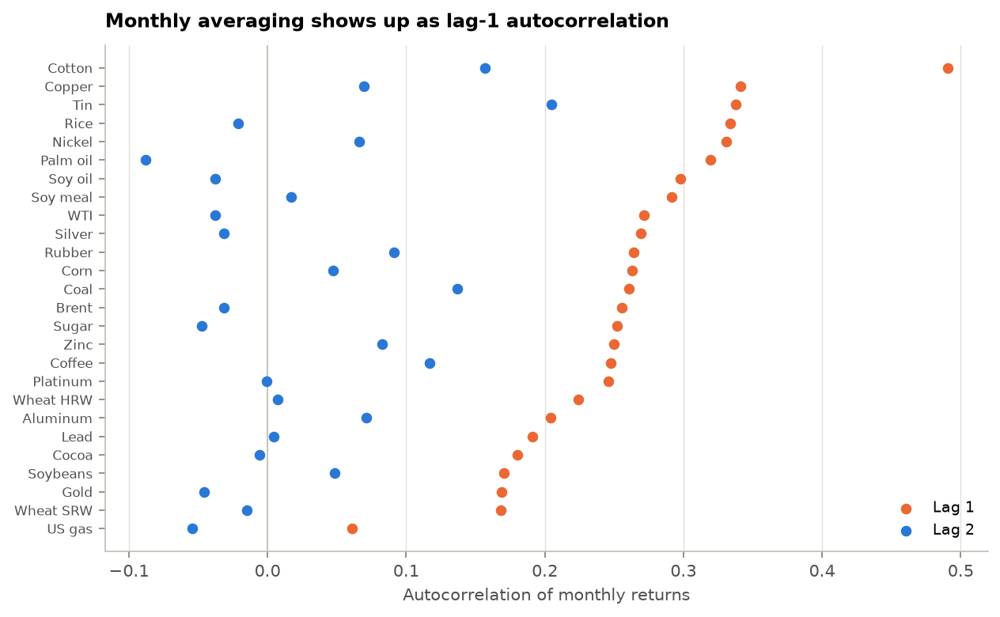
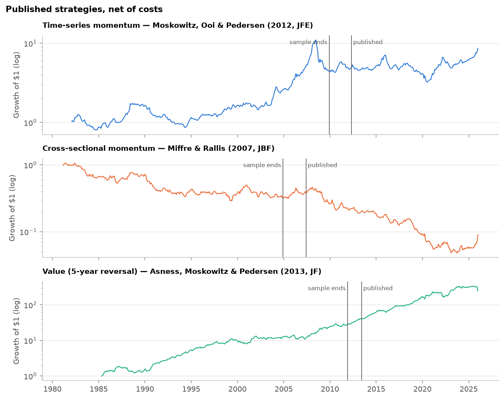
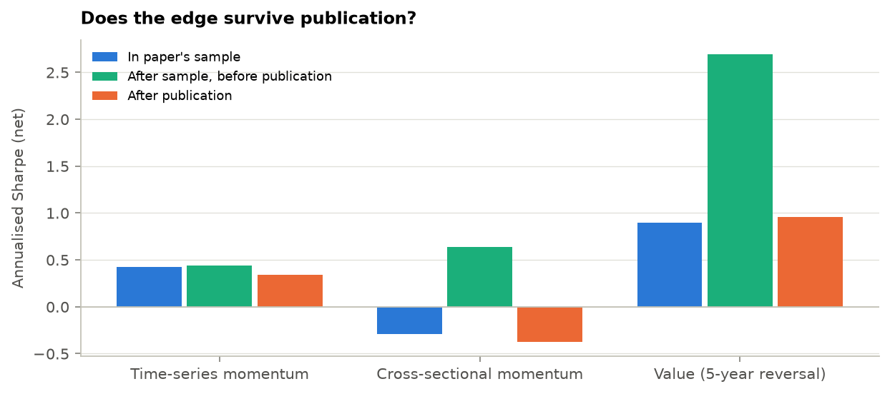
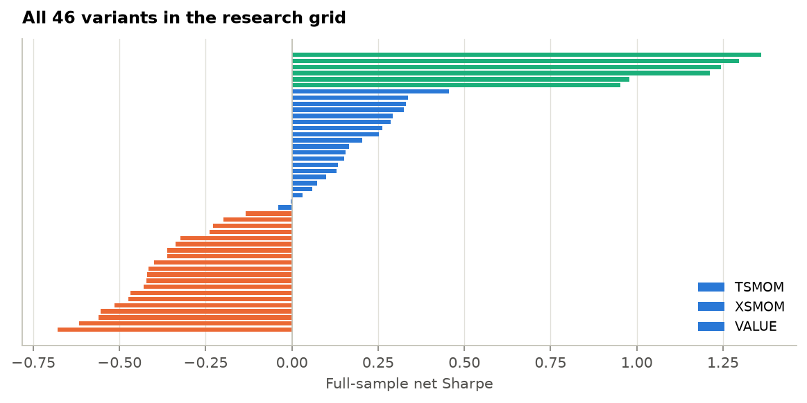
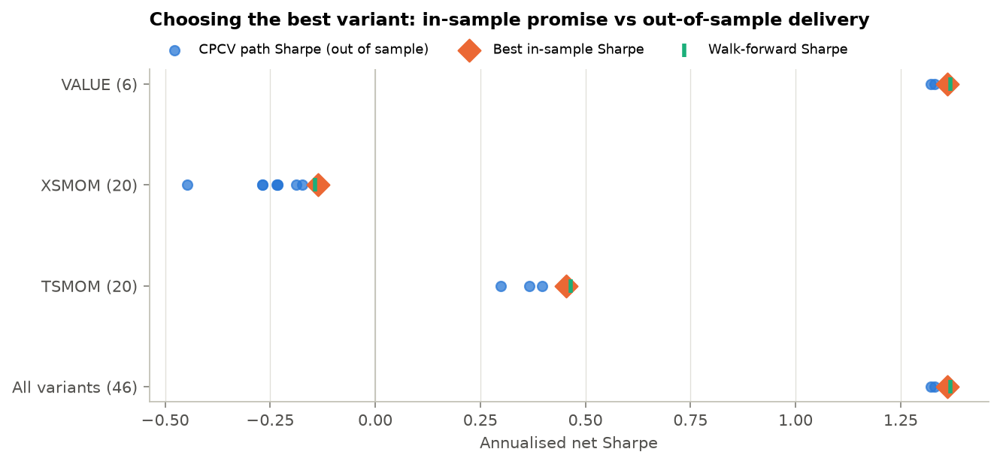
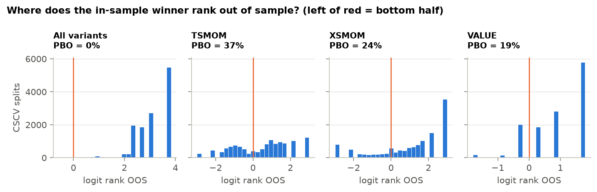
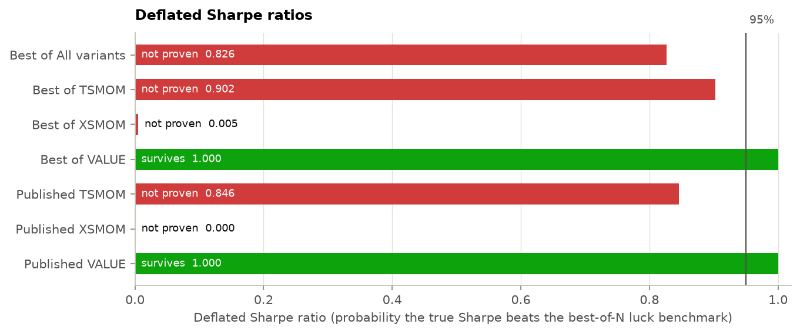

# Factor Validation: Commodity Strategies

*26 commodities · monthly 1980-01–2026-01 · source: GitHub mirror of the World Bank file; Updated on February 03, 2026 · generated 2026-09-27*

## Headline numbers

| Metric | Value | Context |
|---|---|---|
| Value (5y) net Sharpe | **0.95** | t = 5.5 (Newey-West) |
| TSMOM (12-1) net Sharpe | **0.40** | t = 1.9 |
| XS momentum net Sharpe | **−0.28** | t = −1.6 |
| PBO, momentum grid | **37%** | chance the TSMOM winner is below median OOS |
| Variants tried | **46** | every one is charged in the deflated Sharpe |
| Lag-1 autocorrelation | **0.26** | vs 0.01 at lag 2: averaging artefact |

- **Value is the standout and it survives every check.** A 5-year reversal signal earns a net Sharpe of 0.95 with a Newey-West t of 5.5 (above the Harvey–Liu–Zhu t > 3 bar), a deflated Sharpe of 1.000, and a post-publication Sharpe of 0.96.
- **Time-series momentum is real but modest.** Net Sharpe 0.40 (0.43 in the paper's window, 0.34 after publication); t = 1.94 falls short of t > 3, and choosing its best look-back has a 37% probability of being overfit.
- **Cross-sectional momentum does not replicate on spot prices** (net Sharpe −0.28; 0 of its 20 variants is positive). The paper used futures returns; see the caveat below.
- **Value and momentum hedge each other** (correlation −0.54 with XS momentum, −0.35 with TSMOM), as Asness, Moskowitz and Pedersen report across asset classes.
- **Parameter selection is stable.** Out-of-sample Sharpe from purged CPCV is within 0.11 of the in-sample best in every family: rankings barely change between halves of the sample, which is what a low PBO means.

> **Caveat:** **Spot is not futures.** The Pink Sheet reports monthly *average spot* prices. Spot prices mean-revert more than futures returns do, because futures curves already price expected reversion, so value's Sharpe here is an upper bound for a tradable version. Monthly averaging also smooths volatility and adds lag-1 autocorrelation, which is why every signal skips the most recent month.

## 1. Data

World Bank *Pink Sheet* monthly prices for 26 commodities with a liquid futures analogue, 1980-01 to 2026-01. Returns are monthly log changes. A month is tradable once at least 10 commodities have prices.

**Universe**

| Commodity | Sector | Unit | Ann. vol | Lag-1 autocorr | Lag-2 autocorr |
|---|---|---|---|---|---|
| Brent | Energy | ($/bbl) | 31.3% | 0.26 | −0.03 |
| WTI | Energy | ($/bbl) | 32.0% | 0.27 | −0.04 |
| US gas | Energy | ($/mmbtu) | 46.9% | 0.06 | −0.05 |
| Coal | Energy | ($/mt) | 24.1% | 0.26 | 0.14 |
| Aluminum | Base metals | ($/mt) | 18.7% | 0.20 | 0.07 |
| Copper | Base metals | ($/mt) | 21.0% | 0.34 | 0.07 |
| Lead | Base metals | ($/mt) | 22.8% | 0.19 | 0.00 |
| Nickel | Base metals | ($/mt) | 28.2% | 0.33 | 0.07 |
| Tin | Base metals | ($/mt) | 20.2% | 0.34 | 0.20 |
| Zinc | Base metals | ($/mt) | 21.5% | 0.25 | 0.08 |
| Gold | Precious | ($/troy oz) | 13.9% | 0.17 | −0.05 |
| Silver | Precious | ($/troy oz) | 26.1% | 0.27 | −0.03 |
| Platinum | Precious | ($/troy oz) | 20.4% | 0.25 | −0.00 |
| Corn | Grains | ($/mt) | 20.3% | 0.26 | 0.05 |
| Wheat SRW | Grains | ($/mt) | 22.6% | 0.17 | −0.02 |
| Wheat HRW | Grains | ($/mt) | 19.9% | 0.22 | 0.01 |
| Soybeans | Grains | ($/mt) | 17.8% | 0.17 | 0.05 |
| Soy oil | Grains | ($/mt) | 20.1% | 0.30 | −0.04 |
| Soy meal | Grains | ($/mt) | 18.9% | 0.29 | 0.02 |
| Rice | Grains | ($/mt) | 19.4% | 0.33 | −0.02 |
| Palm oil | Grains | ($/mt) | 25.0% | 0.32 | −0.09 |
| Cocoa | Softs | ($/kg) | 22.4% | 0.18 | −0.01 |
| Coffee | Softs | ($/kg) | 24.7% | 0.25 | 0.12 |
| Sugar | Softs | ($/kg) | 29.8% | 0.25 | −0.05 |
| Cotton | Softs | ($/kg) | 18.4% | 0.49 | 0.16 |
| Rubber | Softs | ($/kg) | 23.7% | 0.26 | 0.09 |

*Averaging within the month creates lag-1 autocorrelation (≈0.25 for a random walk, Working 1960); lag 2 is clean.*

## 2. Replicating the published strategies

**What is being replicated**

| Strategy | Paper | Settings | Sample ends | Published |
|---|---|---|---|---|
| Time-series momentum | Moskowitz, Ooi & Pedersen (2012, JFE) | lookback=12, skip=1, scaled=True | 2009-12 | 2012-05 |
| Cross-sectional momentum | Miffre & Rallis (2007, JBF) | lookback=12, skip=1, q=0.333 | 2004-12 | 2007-06 |
| Value (5-year reversal) | Asness, Moskowitz & Pedersen (2013, JF) | years=5, q=0.333 | 2011-12 | 2013-06 |

**Full-sample performance (costs: 10 bp per unit of turnover)**

| Strategy | Returns | Months | Ann. return | Ann. vol | Sharpe | NW t | Max DD | Turnover/mo |
|---|---|---|---|---|---|---|---|---|
| TSMOM | gross | 528 | 6.6% | 14.9% | 0.44 | 2.13 | −68% | 0.48 |
| TSMOM | net | 528 | 6.0% | 14.9% | 0.40 | 1.94 | −70% | 0.48 |
| XSMOM | gross | 539 | −3.4% | 15.1% | −0.22 | −1.29 | −94% | 0.71 |
| XSMOM | net | 539 | −4.2% | 15.1% | −0.28 | −1.62 | −95% | 0.71 |
| VALUE | gross | 489 | 15.3% | 15.6% | 0.98 | 5.68 | −35% | 0.41 |
| VALUE | net | 489 | 14.8% | 15.6% | 0.95 | 5.51 | −35% | 0.41 |
| COMBO | net | 489 | 5.6% | 7.4% | 0.75 | 4.47 | −18% | – |

*Growth of $1, net of costs, with each paper's sample end and publication date.*

**McLean–Pontiff windows: before and after the paper**

| Strategy | Window | From | To | Months | Sharpe | NW t |
|---|---|---|---|---|---|---|
| TSMOM | In paper's sample | 1982-02 | 2009-12 | 335 | 0.43 | 1.60 |
| TSMOM | After sample, before publication | 2010-01 | 2012-05 | 29 | 0.44 | 0.55 |
| TSMOM | After publication | 2012-06 | 2026-01 | 164 | 0.34 | 1.01 |
| XSMOM | In paper's sample | 1981-03 | 2004-12 | 286 | −0.29 | −1.29 |
| XSMOM | After sample, before publication | 2005-01 | 2007-06 | 30 | 0.64 | 1.07 |
| XSMOM | After publication | 2007-07 | 2026-01 | 223 | −0.38 | −1.36 |
| VALUE | In paper's sample | 1985-05 | 2011-12 | 320 | 0.90 | 4.13 |
| VALUE | After sample, before publication | 2012-01 | 2013-06 | 18 | 2.69 | 4.47 |
| VALUE | After publication | 2013-07 | 2026-01 | 151 | 0.96 | 3.23 |

*Sharpe ratio in each window. Short windows (under 3 years) are noisy.*

**Placebo test.** Shuffling each month's positions across commodities keeps the portfolio's shape but destroys which commodity gets which position. For the market-neutral strategies the placebos centre near zero (XS momentum −0.00, value 0.02), so the portfolio code carries no structural bias, and value sits far in the placebo tail (p = 0.005). TSMOM is different: a shuffle keeps each month's net long/short tilt, and that alone earns a Sharpe of 0.38 against the real 0.44. Most of time-series momentum's edge here is timing the commodity complex as a whole, not picking commodities.

**Permutation test (200 shuffles, gross of costs)**

| Strategy | Real gross Sharpe | Placebo mean | Placebo 5–95% | p-value |
|---|---|---|---|---|
| TSMOM | 0.44 | 0.38 | 0.22 to 0.53 | 0.239 |
| XSMOM | −0.22 | −0.00 | −0.22 to 0.21 | 0.945 |
| VALUE | 0.98 | 0.02 | −0.21 to 0.25 | 0.005 |

**Link to the regime workflow.** Months are labelled by the WTI regime the Markov-switching model reported the month before (so the label is known in advance). Turbulent months are few, so treat this as descriptive.

**Strategy performance by energy regime (2007 onward)**

| Strategy | WTI regime last month | Months | Ann. return | Sharpe |
|---|---|---|---|---|
| TSMOM | Calm | 210 | 9.9% | 0.65 |
| TSMOM | Turbulent | 18 | −48.7% | −1.71 |
| XSMOM | Calm | 210 | −3.1% | −0.19 |
| XSMOM | Turbulent | 18 | −38.9% | −1.67 |
| VALUE | Calm | 210 | 15.4% | 1.04 |
| VALUE | Turbulent | 18 | 35.9% | 1.43 |

## 3. Choosing parameters without fooling yourself

The research grid holds **46 variants**: look-backs of 1–12 months, one- or two-month skips, vol-scaling on or off, terciles or quartiles, and 3–5 year value windows. Picking the best one after seeing the results is the classic way to overfit. **Combinatorial purged cross-validation** (López de Prado, 2018) splits 1980–2026 into 10 blocks, holds out 2 at a time (45 splits, 9 complete out-of-sample paths), chooses the best variant on the rest, and drops 1 month before and 12 months after each held-out block so overlapping look-back windows cannot leak.

*Full-sample net Sharpe of every variant, coloured by family.*

**In-sample promise vs out-of-sample delivery (annualised net Sharpe)**

| Variant set | N | Method | In-sample best | Out-of-sample | Shortfall | Most chosen |
|---|---|---|---|---|---|---|
| All variants | 46 | Purged CPCV | 1.36 | 1.35 | 0.01 | VALUE 4y q=1/4 |
| All variants | 46 | Naive CV | 1.36 | 1.36 | 0.00 | VALUE 4y q=1/4 |
| All variants | 46 | Walk-forward | 1.36 | 1.37 | −0.01 | VALUE 3y q=1/3 |
| TSMOM | 20 | Purged CPCV | 0.45 | 0.42 | 0.03 | TSMOM 12-1 vol-scaled |
| TSMOM | 20 | Naive CV | 0.45 | 0.45 | −0.00 | TSMOM 12-1 vol-scaled |
| TSMOM | 20 | Walk-forward | 0.45 | 0.47 | −0.01 | TSMOM 12-1 vol-scaled |
| XSMOM | 20 | Purged CPCV | −0.14 | −0.24 | 0.11 | XSMOM 9-2 q=1/4 |
| XSMOM | 20 | Naive CV | −0.14 | −0.23 | 0.10 | XSMOM 9-2 q=1/4 |
| XSMOM | 20 | Walk-forward | −0.14 | −0.14 | 0.01 | XSMOM 9-2 q=1/4 |
| VALUE | 6 | Purged CPCV | 1.36 | 1.35 | 0.01 | VALUE 4y q=1/4 |
| VALUE | 6 | Naive CV | 1.36 | 1.36 | 0.00 | VALUE 4y q=1/4 |
| VALUE | 6 | Walk-forward | 1.36 | 1.37 | −0.01 | VALUE 3y q=1/3 |

*Each dot is one CPCV path. The diamond is what a backtest of the best variant would report.*

Purging changes little here because the strategies are simple rules: the only thing fitted is the choice of variant, and rankings are stable. Purging matters far more for fitted models (regressions, trees) trained on overlapping labels; the code handles both.

## 4. Overfitting diagnostics

**Probability of backtest overfitting (CSCV, 16 blocks)**

| Variant set | Variants | CSCV splits | PBO | OOS Sharpe < 0 | Verdict |
|---|---|---|---|---|---|
| All variants | 46 | 12,870 | 0.1% | 2% | ✔ Low risk |
| TSMOM | 20 | 12,870 | 37.2% | 20% | ✔ Low risk |
| XSMOM | 20 | 12,870 | 24.5% | 81% | ✔ Low risk |
| VALUE | 6 | 12,870 | 18.5% | 0% | ✔ Low risk |

*Logit of the in-sample winner's out-of-sample rank. Mass left of zero = overfitting.*

**Probabilistic and deflated Sharpe ratios (annualised Sharpe; DSR > 0.95 to pass)**

| Candidate | Variant | Trials N | Sharpe | Luck bar SR0 | PSR vs 0 | DSR | NW t | Verdict |
|---|---|---|---|---|---|---|---|---|
| Best of All variants | VALUE 4y q=1/4 | 46 | 1.36 | 1.20 | 1.000 | 0.826 | 7.37 | ✖ Not proven |
| Best of TSMOM | TSMOM 12-1 vol-scaled | 20 | 0.45 | 0.25 | 0.998 | 0.902 | 2.10 | ✖ Not proven |
| Best of XSMOM | XSMOM 9-2 q=1/4 | 20 | −0.14 | 0.27 | 0.194 | 0.005 | −0.78 | ✖ Not proven |
| Best of VALUE | VALUE 4y q=1/4 | 6 | 1.36 | 0.22 | 1.000 | 1.000 | 7.37 | ✔ Survives |
| Published TSMOM | TSMOM 12-1 vol-scaled | 20 | 0.40 | 0.25 | 0.996 | 0.846 | 1.94 | ✖ Not proven |
| Published XSMOM | XSMOM 12-1 q=1/3 | 20 | −0.28 | 0.27 | 0.032 | 0.000 | −1.62 | ✖ Not proven |
| Published VALUE | VALUE 5y q=1/3 | 6 | 0.95 | 0.22 | 1.000 | 1.000 | 5.51 | ✔ Survives |

*Deflated Sharpe ratios; bars in green pass the 95% bar.*

**Reading the luck bar.** SR0 is the Sharpe the best of N variants would show with zero true skill, given how much the variants' Sharpes differ. Across all 46 variants the bar is high because the families differ in genuine skill, not only luck; within a family it is the fairer test, which is why each published strategy is deflated by its own family.

## 5. Validation summary

**Validation evidence**

| Check | How | Result | Status |
|---|---|---|---|
| Look-ahead | Signals use prices through t−1; placebo and no-look-ahead tests | Market-neutral placebos centre on 0.02 or less | ✔ Pass |
| Data artefact | Lag-1 autocorrelation from monthly averaging | Median 0.26; neutralised by skipping a month | ✔ Pass |
| Replication | Published settings, gross and net | Positive net Sharpe: TSMOM, VALUE; negative: XSMOM | ▲ Partial |
| Decay | McLean–Pontiff windows | Post-publication Sharpe: value 0.96, TSMOM 0.34 | ✔ Pass |
| Selection bias | Purged CPCV, walk-forward | Out-of-sample within 0.11 of in-sample in every family | ✔ Pass |
| Overfitting | PBO (CSCV), deflated Sharpe | PBO 37% for TSMOM; value DSR 1.000 | ▲ Family-dependent |

### Limitations

- Spot, monthly-average prices: not the futures excess returns the papers use. No roll yield, so no carry strategy.
- Costs are a flat 10 bp per unit of turnover; real costs vary by market and by era.
- The grid is what one researcher might try. The literature as a whole tried far more, so true N is larger.
- The regime split has only 18 turbulent months: descriptive only.

### References

- Moskowitz, T., Ooi, Y. H. & Pedersen, L. H. (2012). Time series momentum. *Journal of Financial Economics*, 104(2).
- Miffre, J. & Rallis, G. (2007). Momentum strategies in commodity futures markets. *Journal of Banking & Finance*, 31(6).
- Asness, C., Moskowitz, T. & Pedersen, L. H. (2013). Value and momentum everywhere. *Journal of Finance*, 68(3).
- McLean, R. D. & Pontiff, J. (2016). Does academic research destroy stock return predictability? *Journal of Finance*, 71(1).
- Bailey, D. & López de Prado, M. (2012). The Sharpe ratio efficient frontier. *Journal of Risk*, 15(2).
- Bailey, D. & López de Prado, M. (2014). The deflated Sharpe ratio. *Journal of Portfolio Management*, 40(5).
- Bailey, D., Borwein, J., López de Prado, M. & Zhu, Q. (2017). The probability of backtest overfitting. *Journal of Computational Finance*, 20(4).
- López de Prado, M. (2018). *Advances in Financial Machine Learning*. Wiley. Chapters 7, 11, 12.
- Harvey, C., Liu, Y. & Zhu, H. (2016). ... and the cross-section of expected returns. *Review of Financial Studies*, 29(1).
- Working, H. (1960). Note on the correlation of first differences of averages in a random chain. *Econometrica*, 28(4).
- World Bank (2026). Commodity Price Data (The Pink Sheet), monthly historical data.
