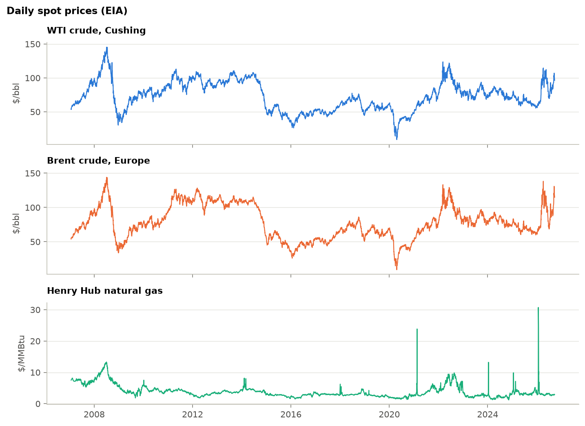
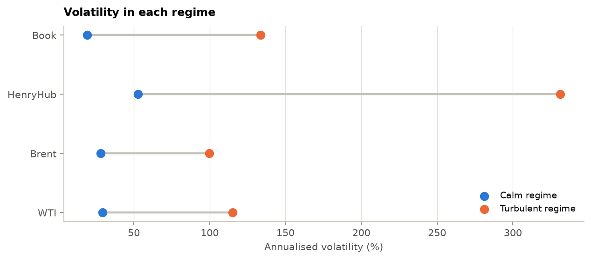
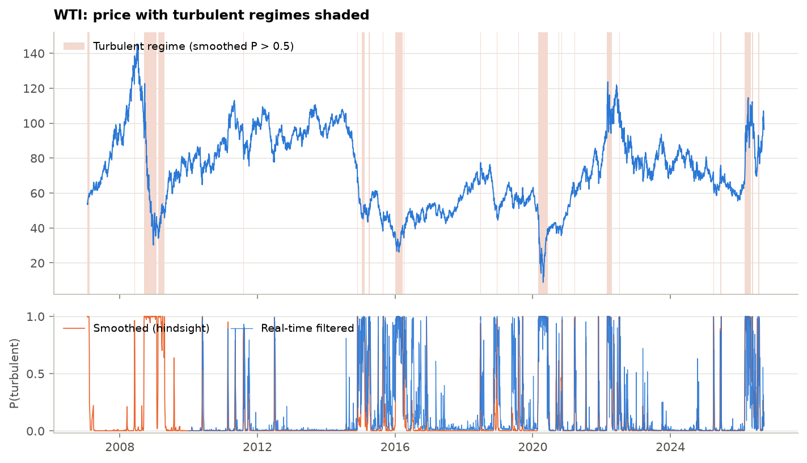
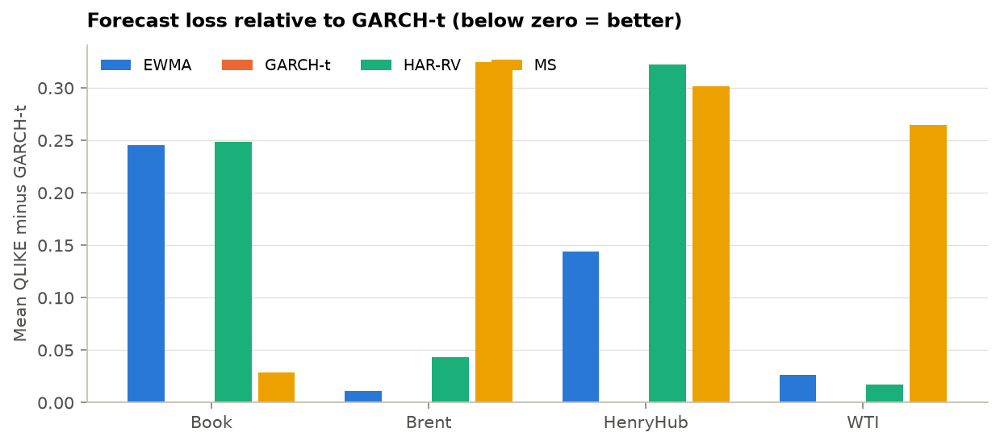
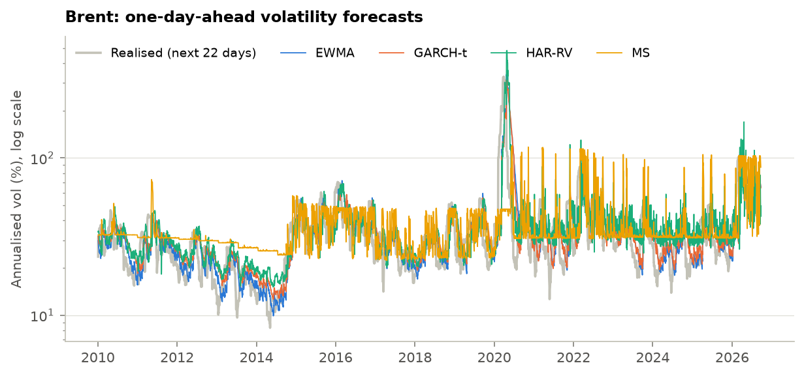
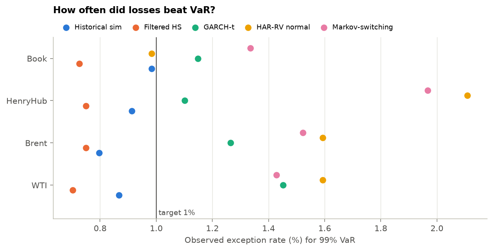
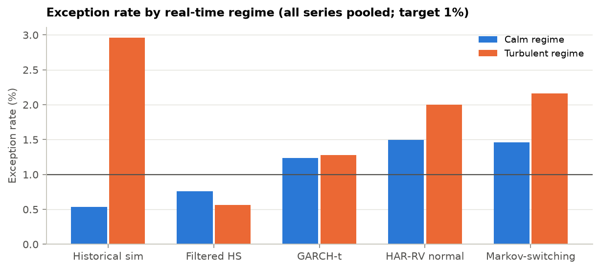
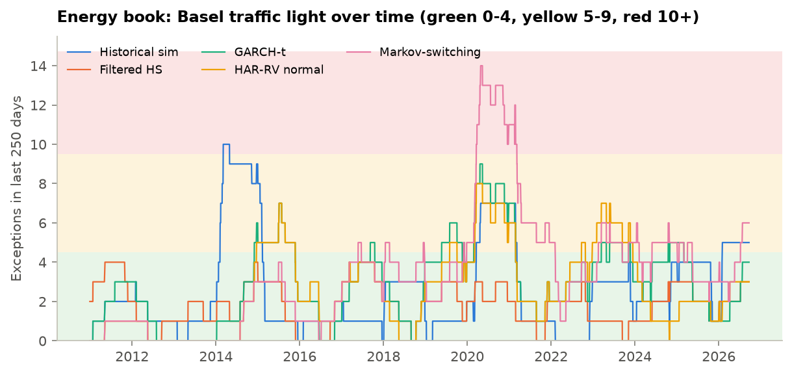
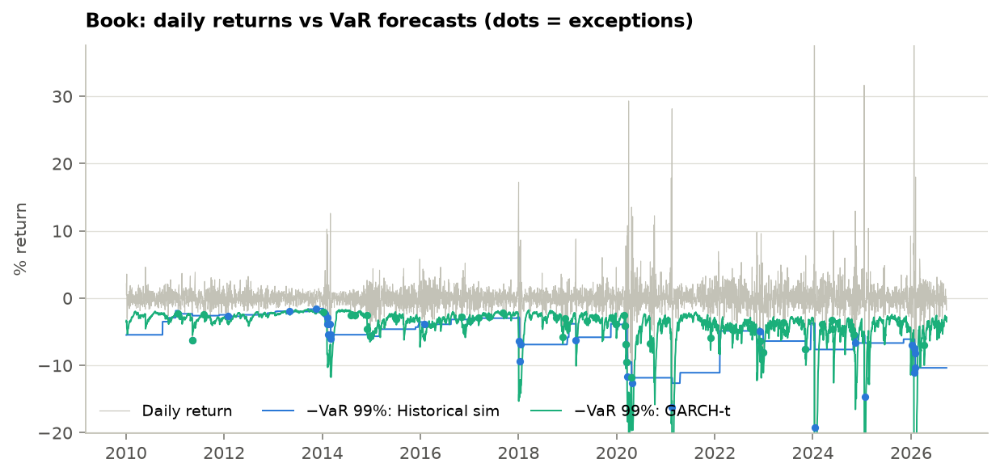

# Regime & Risk: Energy Benchmarks

*WTI, Brent, Henry Hub and an $8mm energy book · daily data 2007–2026-09-22 · source: GitHub mirror of EIA · generated 2026-09-27*

## Headline numbers

| Metric | Value | Context |
|---|---|---|
| Book 1-day 99% VaR | **$258.4k** | GARCH-t, as of 2026-09-22 |
| Book 97.5% ES | **$274.1k** | average loss beyond VaR |
| Best backtest record | **Filtered HS & GARCH-t** | each passes 3 of 4 series |
| HS misses in turbulence | **3.0%** | vs 0.5% in calm; target 1.0% |
| Best variance forecast | **GARCH-t** | lowest QLIKE on 4 of 4 series |
| Turbulent now | **none** | regime with highest filtered probability |

- **Regimes are real and persistent.** Calm spells last 51–94 trading days on average; turbulent spells 4–13 days, with volatility 3.5–6.9× the calm level.
- **Plain historical simulation is regime-blind.** Its 99% VaR was beaten on 0.5% of calm days but 3.0% of turbulent days: the 250-day window is too slow to absorb a new volatility regime, so exceptions arrive in clusters (Christoffersen rejects HS on 3 of 4 series).
- **Filtering fixes most of it.** Rescaling history to today's EWMA volatility (filtered HS) cuts the turbulent-regime exception rate to 0.6% and passes coverage and independence on 3 of 4 series.
- **GARCH-t forecasts variance best, yet its VaR still fails on WTI**: 62 exceptions against 43 expected (Kupiec p = 0.005). A good volatility forecast is necessary for a good VaR, not sufficient: the tail shape matters too.
- **Normal tails fail.** HAR-RV with normal quantiles records 268 exceptions across the four series against 171 expected; its average Z2 of −0.29 says realised tail losses run well beyond its ES.

> **Note:** All forecasts are out of sample: each day's VaR uses only data available the evening before. The positions are hypothetical and priced off EIA spot benchmarks, not tradable futures.

## 1. Data

Daily EIA spot prices from 2007-01-02 to 2026-09-22. Returns are daily log changes in %. The **energy book** holds constant dollar positions: WTI $4.00mm, Brent −$2.00mm, Henry Hub $2.00mm (a long WTI–Brent spread plus long US gas); its return is P&L over gross notional.

**Data pull log**

| Series | Description | Unit | Source | First | Last | Rows |
|---|---|---|---|---|---|---|
| WTI | WTI crude, Cushing | $/bbl | GitHub mirror of EIA (DCOILWTICO) | 1986-01-02 | 2026-09-22 | 9,507 |
| Brent | Brent crude, Europe | $/bbl | GitHub mirror of EIA (DCOILBRENTEU) | 1987-05-20 | 2026-09-22 | 9,092 |
| HenryHub | Henry Hub natural gas | $/MMBtu | GitHub mirror of EIA (DHHNGSP) | 1997-01-07 | 2026-09-22 | 5,692 |

**Return statistics (daily log returns)**

| Series | Ann. vol | Skew | Excess kurtosis | Worst day | Best day |
|---|---|---|---|---|---|
| WTI | 47.6% | −2.17 | 89.2 | −72.0% (2020-04-21) | 42.6% (2020-04-22) |
| Brent | 43.8% | −2.07 | 80.0 | −64.4% (2020-04-21) | 41.2% (2020-04-22) |
| HenryHub | 111.5% | 1.17 | 117.3 | −140.2% (2024-01-16) | 143.3% (2024-01-12) |
| Book | 39.5% | 11.95 | 338.2 | −19.2% (2024-01-16) | 80.4% (2024-01-12) |

**Data quality.** 5 fixes were applied and logged (`01_data_quality_fixes.csv`), including WTI's negative print on 2020-04-20 (set to missing: a log return is undefined). 45 extreme moves were **flagged but kept** (`01_flagged_moves.csv`); crashes and gas spikes are exactly what risk models must survive.

*EIA daily spot prices.*

## 2. Regimes

A Gaussian **Markov-switching model** (Hamilton, 1989) lets each market move between a calm and a turbulent state, each with its own mean and volatility, switching with fixed daily probabilities. The regime is never observed; the model infers the probability of each regime every day.

**Two-regime model, full sample**

| Series | Regime | Ann. vol | Daily mean | Stay prob. | Avg. spell (days) | Share of days |
|---|---|---|---|---|---|---|
| WTI | Calm | 29.4% | 0.032% | 0.989 | 91.2 | 89.8% |
| WTI | Turbulent | 115.2% | −0.147% | 0.912 | 11.4 | 10.2% |
| Brent | Calm | 28.2% | 0.034% | 0.989 | 93.8 | 88.6% |
| Brent | Turbulent | 99.8% | −0.119% | 0.924 | 13.1 | 11.4% |
| HenryHub | Calm | 52.6% | −0.039% | 0.980 | 50.8 | 92.0% |
| HenryHub | Turbulent | 331.2% | 0.179% | 0.802 | 5.0 | 8.0% |
| Book | Calm | 19.3% | 0.006% | 0.982 | 55.4 | 94.3% |
| Book | Turbulent | 133.5% | 1.065% | 0.748 | 4.0 | 5.7% |

*Annualised volatility in each regime.*

*WTI: turbulent regimes (shaded) and the probability of turbulence, smoothed vs real time.*

**Model choice.** BIC prefers three regimes on 4 of 4 series (e.g. WTI: 22,341 with two vs 21,930 with three). With Gaussian regimes an extra state mostly absorbs fat tails, so this project keeps the two-regime model for interpretability and reports the three-regime fit in `02_model_selection.csv`. That trade-off is a documented model choice, not an oversight.

**Does the estimator work?** Three data sets were simulated from each fitted model and re-estimated. The EM algorithm recovers regime volatilities within a few percent and classifies the true hidden state on almost every day:

**Simulation-based verification**

| Series | Worst vol error | Worst state accuracy |
|---|---|---|
| Book | 4.9% | 98.5% |
| Brent | 5.8% | 98.0% |
| HenryHub | 3.5% | 97.8% |
| WTI | 6.2% | 98.1% |

**Current regime (filtered, 2026-09-22)**

| Series | Regime today | Probability | P(turbulent) | Days in regime |
|---|---|---|---|---|
| WTI | Calm | 0.94 | 0.06 | 35 |
| Brent | Calm | 0.56 | 0.44 | 1 |
| HenryHub | Calm | 1.00 | 0.00 | 52 |
| Book | Calm | 1.00 | 0.00 | 117 |

**Longest turbulent episodes (smoothed probability > 0.5)**

| Series | Start | End | Days | Price change | Realised vol |
|---|---|---|---|---|---|
| Brent | 2008-09-15 | 2009-01-27 | 93 | −52.6% | 82% |
| WTI | 2008-09-15 | 2009-01-27 | 93 | −56.4% | 99% |
| Brent | 2026-03-02 | 2026-06-29 | 84 | −7.3% | 81% |
| WTI | 2020-02-28 | 2020-06-11 | 73 | −18.7% | 239% |
| Brent | 2020-03-06 | 2020-06-12 | 69 | −15.5% | 213% |
| WTI | 2016-01-06 | 2016-03-23 | 56 | 12.7% | 74% |
| Brent | 2022-02-25 | 2022-05-12 | 54 | 9.6% | 71% |
| WTI | 2009-02-10 | 2009-04-20 | 48 | 22.1% | 82% |

## 3. Volatility forecasts

Four one-day-ahead variance forecasts, all out of sample. They are scored with **QLIKE** (log h + r²/h), which ranks forecasts correctly even though the squared return is a very noisy measure of true variance (Patton, 2011). **Diebold–Mariano** tests ask whether the gap to GARCH-t is bigger than chance.

**Mean QLIKE loss (lower is better; ★ = best)**

| Series | EWMA | GARCH-t | HAR-RV | Markov-switching |
|---|---|---|---|---|
| Book | 2.446 | 2.201 ★ | 2.449 | 2.229 |
| Brent | 2.425 | 2.414 ★ | 2.457 | 2.739 |
| HenryHub | 4.149 | 4.004 ★ | 4.327 | 4.306 |
| WTI | 2.541 | 2.514 ★ | 2.531 | 2.778 |

**Diebold–Mariano tests against GARCH-t (positive = higher loss than GARCH-t)**

| Series | Model vs GARCH-t | DM stat (QLIKE) | p-value | Verdict |
|---|---|---|---|---|
| WTI | EWMA | 3.71 | <0.001 | ✖ Worse than GARCH-t |
| WTI | HAR-RV | 1.60 | 0.110 | No significant difference |
| WTI | MS | 2.17 | 0.030 | ✖ Worse than GARCH-t |
| Brent | EWMA | 1.89 | 0.058 | No significant difference |
| Brent | HAR-RV | 3.14 | 0.002 | ✖ Worse than GARCH-t |
| Brent | MS | 2.00 | 0.046 | ✖ Worse than GARCH-t |
| HenryHub | EWMA | 2.84 | 0.005 | ✖ Worse than GARCH-t |
| HenryHub | HAR-RV | 2.32 | 0.020 | ✖ Worse than GARCH-t |
| HenryHub | MS | 3.03 | 0.002 | ✖ Worse than GARCH-t |
| Book | EWMA | 1.90 | 0.057 | No significant difference |
| Book | HAR-RV | 1.59 | 0.111 | No significant difference |
| Book | MS | 0.26 | 0.793 | No significant difference |

*Loss relative to GARCH-t by series.*

*Brent: forecasts vs the volatility realised over the next month.*

**GARCH estimator check.** Refitting simulated GARCH-t paths recovers persistence (α+β) within 0.015 on every series. HAR-RV is handicapped here: with daily closes only, realised variance is proxied by the squared return, which throws away most of the information intraday data would give.

## 4. VaR and ES backtests

Five models forecast 1-day 99% VaR and 97.5% ES every day from 2010-01-04 (4,269 days). A model **passes** when neither Kupiec (right number of exceptions) nor conditional coverage (right number *and* no clustering) rejects at 5%.

**Backtest results, 99% VaR (exceptions observed / expected)**

| Series | Model | Exceptions | Kupiec p | Christoffersen p | CC p | Zone (last 250d) | Z2 | Verdict |
|---|---|---|---|---|---|---|---|---|
| WTI | Historical sim | 37 / 43 | 0.370 | 0.004 | 0.010 | green | −0.19 | ✖ Reject |
| WTI | Filtered HS | 30 / 43 | 0.039 | 0.018 | 0.007 | green | −0.06 | ✖ Reject |
| WTI | GARCH-t | 62 / 43 | 0.005 | 0.310 | 0.012 | green | −0.38 | ✖ Reject |
| WTI | HAR-RV normal | 68 / 43 | <0.001 | 0.934 | 0.002 | yellow | −0.27 | ✖ Reject |
| WTI | Markov-switching | 61 / 43 | 0.008 | 0.892 | 0.030 | green | −0.41 | ✖ Reject |
| Brent | Historical sim | 34 / 43 | 0.166 | 0.276 | 0.212 | green | −0.24 | ✔ Pass |
| Brent | Filtered HS | 32 / 43 | 0.085 | 0.242 | 0.115 | green | −0.09 | ✔ Pass |
| Brent | GARCH-t | 54 / 43 | 0.095 | 0.716 | 0.232 | green | −0.20 | ✔ Pass |
| Brent | HAR-RV normal | 68 / 43 | <0.001 | 0.422 | 0.001 | yellow | −0.33 | ✖ Reject |
| Brent | Markov-switching | 65 / 43 | 0.001 | 0.097 | 0.002 | green | −0.33 | ✖ Reject |
| HenryHub | Historical sim | 39 / 43 | 0.565 | <0.001 | <0.001 | green | −0.31 | ✖ Reject |
| HenryHub | Filtered HS | 32 / 43 | 0.085 | 0.487 | 0.179 | green | 0.03 | ✔ Pass |
| HenryHub | GARCH-t | 47 / 43 | 0.514 | 0.306 | 0.479 | green | −0.06 | ✔ Pass |
| HenryHub | HAR-RV normal | 90 / 43 | <0.001 | 0.172 | <0.001 | green | −0.67 | ✖ Reject |
| HenryHub | Markov-switching | 84 / 43 | <0.001 | 0.113 | <0.001 | yellow | −0.59 | ✖ Reject |
| Book | Historical sim | 42 / 43 | 0.915 | <0.001 | <0.001 | yellow | −0.11 | ✖ Reject |
| Book | Filtered HS | 31 / 43 | 0.059 | 0.501 | 0.133 | green | −0.00 | ✔ Pass |
| Book | GARCH-t | 49 / 43 | 0.343 | 0.594 | 0.554 | green | 0.04 | ✔ Pass |
| Book | HAR-RV normal | 42 / 43 | 0.915 | 0.435 | 0.733 | green | 0.11 | ✔ Pass |
| Book | Markov-switching | 57 / 43 | 0.036 | 0.230 | 0.054 | yellow | −0.24 | ✖ Reject |

*Observed exception rates against the 1% target.*

*Exception rate split by the regime the model knew about at forecast time.*

*Rolling 250-day exception counts for the energy book with Basel zones.*

*Energy book: returns against historical-simulation and GARCH-t VaR.*

**Next-day risk as of 2026-09-22**

| Series | Model | Notional | VaR 99% | ES 97.5% | VaR % of notional |
|---|---|---|---|---|---|
| WTI | Historical sim | $1.00mm | $115.6k | $109.6k | 12.28% |
| WTI | Filtered HS | $1.00mm | $82.3k | $79.8k | 8.58% |
| WTI | GARCH-t | $1.00mm | $69.3k | $71.7k | 7.18% |
| WTI | HAR-RV normal | $1.00mm | $55.6k | $55.9k | 5.72% |
| WTI | Markov-switching | $1.00mm | $70.6k | $74.0k | 7.32% |
| Brent | Historical sim | $1.00mm | $123.5k | $109.8k | 13.19% |
| Brent | Filtered HS | $1.00mm | $118.0k | $101.6k | 12.55% |
| Brent | GARCH-t | $1.00mm | $94.5k | $97.8k | 9.93% |
| Brent | HAR-RV normal | $1.00mm | $66.4k | $66.7k | 6.87% |
| Brent | Markov-switching | $1.00mm | $117.7k | $118.2k | 12.53% |
| HenryHub | Historical sim | $1.00mm | $387.2k | $338.2k | 48.97% |
| HenryHub | Filtered HS | $1.00mm | $117.4k | $82.8k | 12.49% |
| HenryHub | GARCH-t | $1.00mm | $80.9k | $87.2k | 8.43% |
| HenryHub | HAR-RV normal | $1.00mm | $122.1k | $122.6k | 13.02% |
| HenryHub | Markov-switching | $1.00mm | $88.6k | $118.2k | 9.27% |
| Book | Historical sim | $8.00mm | $828.8k | $680.9k | 10.36% |
| Book | Filtered HS | $8.00mm | $294.4k | $257.0k | 3.68% |
| Book | GARCH-t | $8.00mm | $258.4k | $274.1k | 3.23% |
| Book | HAR-RV normal | $8.00mm | $433.4k | $435.5k | 5.42% |
| Book | Markov-switching | $8.00mm | $259.0k | $350.9k | 3.24% |

**Expected Shortfall.** Z2 near zero means ES was about right; negative values mean realised losses beyond VaR were larger than ES predicted. Acerbi and Szekely's thresholds (−0.70 yellow, −1.8 red) are calibrated to one year of data, so the share of rolling years below −0.70 is in `04_backtest_results.csv`.

## 5. Model validation summary

Organised the way a model risk team reviews a model under the Fed/OCC **SR 11-7** guidance.

**Validation evidence**

| Check | How | Result | Status |
|---|---|---|---|
| Conceptual soundness | Simulate from each fitted model, re-estimate, compare | MS vol error ≤ 6.2%, state accuracy ≥ 97.8%; GARCH persistence error ≤ 0.015 | ✔ Pass |
| Model selection | BIC across 2 vs 3 regimes | BIC prefers 3 on 4 of 4 series; 2 kept for interpretability | ▲ Documented choice |
| Benchmarking | Diebold–Mariano against GARCH-t | GARCH-t has the lowest QLIKE on 4 of 4 series | ✔ Pass |
| Outcomes analysis | Kupiec, Christoffersen, conditional coverage, Z2, McNeil–Frey | 8 of 20 model–series pairs pass; best: Filtered HS & GARCH-t | ▲ Mixed |
| Ongoing monitoring | Basel traffic light on rolling 250 days | 15 of 20 pairs green today | ✔ Pass |

### Limitations

- Spot benchmarks, not futures: Henry Hub spot spikes during cold snaps are far larger than front-month futures moves.
- Daily closes only: HAR-RV and realised-volatility checks use squared returns, a noisy proxy.
- Gaussian regimes: tails inside each regime are thin; a Student-t Markov-switching model would be the next step.
- Univariate book: the book's risk is modelled on its own P&L series, so correlations change only implicitly.
- Positions are constant-dollar and linear: no options, no liquidity horizons, no basis between spot and hedges.

### References

- Hamilton, J. (1989). A new approach to the economic analysis of nonstationary time series. *Econometrica*, 57(2).
- Kim, C.-J. (1994). Dynamic linear models with Markov-switching. *Journal of Econometrics*, 60.
- Bollerslev, T. (1987). A conditionally heteroskedastic time series model for speculative prices. *REStat*, 69(3).
- Corsi, F. (2009). A simple approximate long-memory model of realized volatility. *J. Financial Econometrics*, 7(2).
- Patton, A. (2011). Volatility forecast comparison using imperfect volatility proxies. *J. Econometrics*, 160(1).
- Diebold, F. & Mariano, R. (1995). Comparing predictive accuracy. *JBES*, 13(3).
- Kupiec, P. (1995); Christoffersen, P. (1998); Acerbi, C. & Szekely, B. (2014); McNeil, A. & Frey, R. (2000).
- Hull, J. & White, A. (1998). Incorporating volatility updating into historical simulation. *Journal of Risk*, 1(1).
- Board of Governors of the Federal Reserve System & OCC (2011). SR 11-7: Guidance on Model Risk Management.
